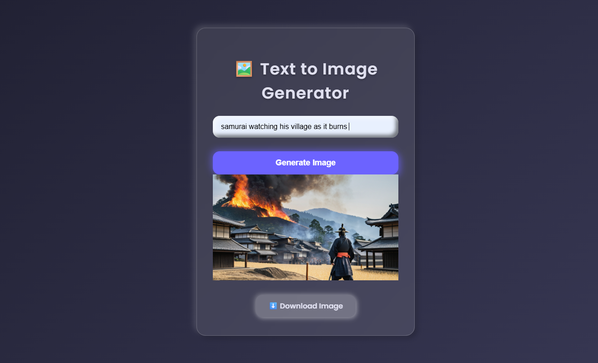

# Text to Image Generator

A modern, visually appealing web application that transforms your text prompts into stunning images using the Vyro AI API. This project demonstrates seamless integration of frontend technologies with a powerful image generation backend, wrapped in a beautiful glassmorphic UI.

## Features

- **Text-to-Image Generation:** Enter a descriptive prompt and generate a realistic image using AI.
- **Instant Download:** Download the generated image with a single click.
- **Responsive & Modern UI:** Clean, glassmorphic design with smooth user experience.
- **Loading Feedback:** Animated spinner indicates when your image is being generated.
- **Keyboard Shortcuts:** Press Enter to submit your prompt quickly.

## Demo
 
## Getting Started

### Prerequisites
- Node.js (for local development, if you wish to add a backend or use a package manager)
- A Vyro AI API key ([get one here](https://vyro.ai/))

### Installation
1. **Clone the repository:**
   ```bash
   git clone https://github.com/yourusername/text-image.git
   cd text-image
   ```
2. **Set up environment variables:**
   - Copy `example.env` to `.env`:
     ```bash
     cp example.env .env
     ```
   - Add your API key to `.env`:
     ```env
     API_KEY=your_actual_api_key
     ```
3. **Open `index.html` in your browser.**
   - No build step is required; this is a pure frontend project.

## Usage

1. Enter a descriptive prompt in the input box (e.g., "A futuristic city at sunset").
2. Click **Generate Image** or press **Enter**.
3. Wait for the spinner to finish; your image will appear below.
4. Click the **Download Image** button to save your result.

## Project Structure

- `index.html` – Main HTML file
- `app.js` – Handles prompt submission, API requests, and image rendering
- `styles.css` – Glassmorphic, responsive styles
- `.env` – Your API key (not tracked by git)
- `example.env` – Example environment file for sharing

## Tech Stack

- **Frontend:** HTML5, CSS3 (glassmorphism, responsive), JavaScript (ES6)
- **API:** [Vyro AI Image Generation API](https://vyro.ai/)

## Environment Variables

| Variable   | Description         |
|------------|---------------------|
| API_KEY    | Your Vyro AI API key|

> **Note:** Never share your real `.env` file or API keys publicly. Use `example.env` for sharing required variables.

## Contributing

Contributions are welcome! Please open an issue or submit a pull request for improvements, bug fixes, or new features.

1. Fork the repository
2. Create your feature branch (`git checkout -b feature/YourFeature`)
3. Commit your changes (`git commit -am 'Add new feature'`)
4. Push to the branch (`git push origin feature/YourFeature`)
5. Open a pull request


## Acknowledgements

- [Vyro AI](https://vyro.ai/) for the image generation API
- [Google Fonts – Poppins](https://fonts.google.com/specimen/Poppins) for typography 
